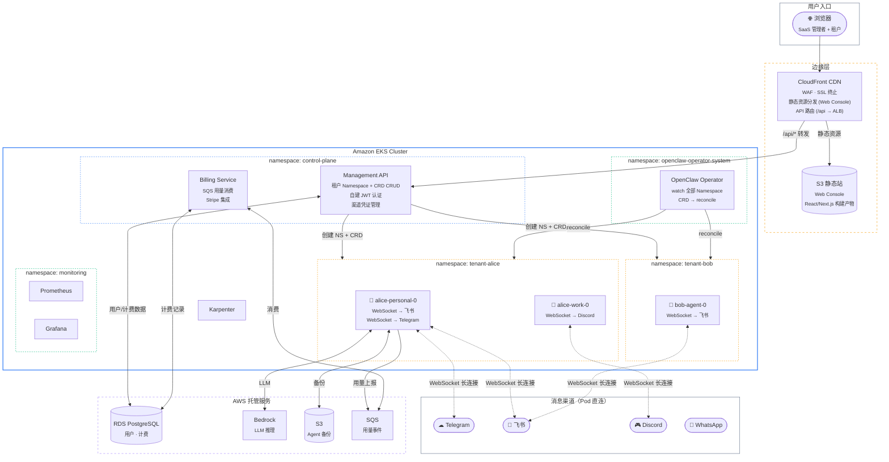
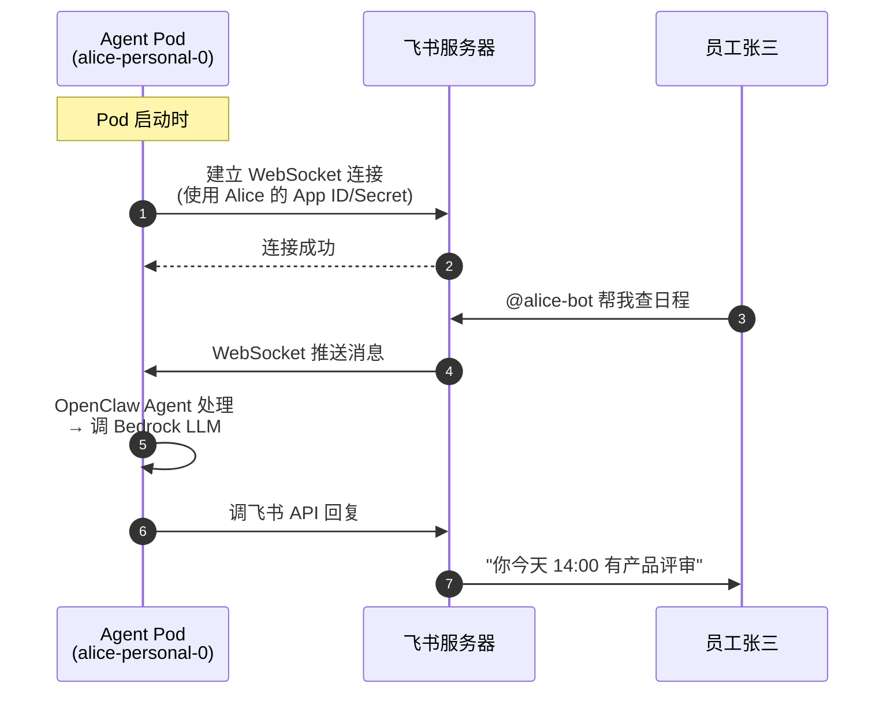
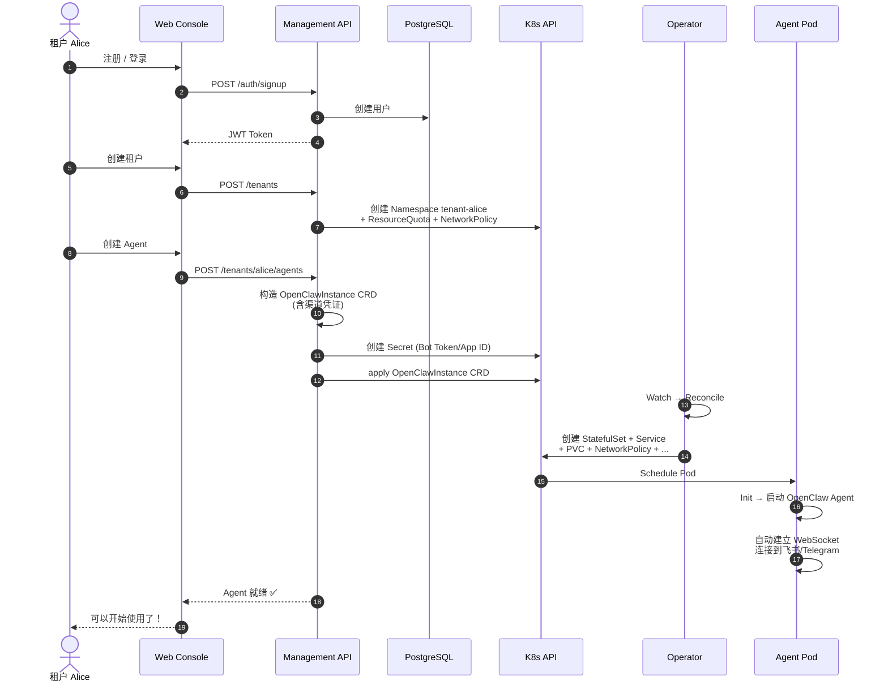
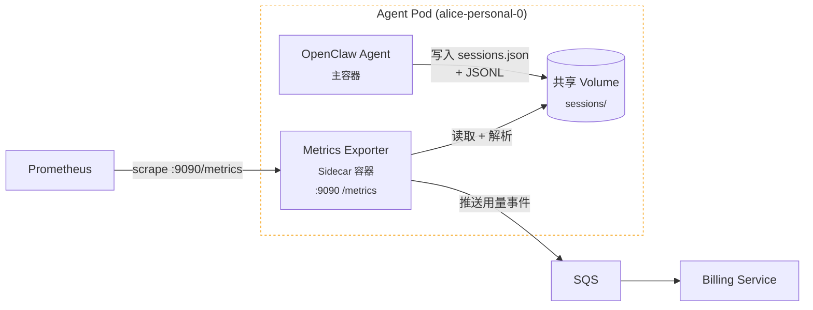
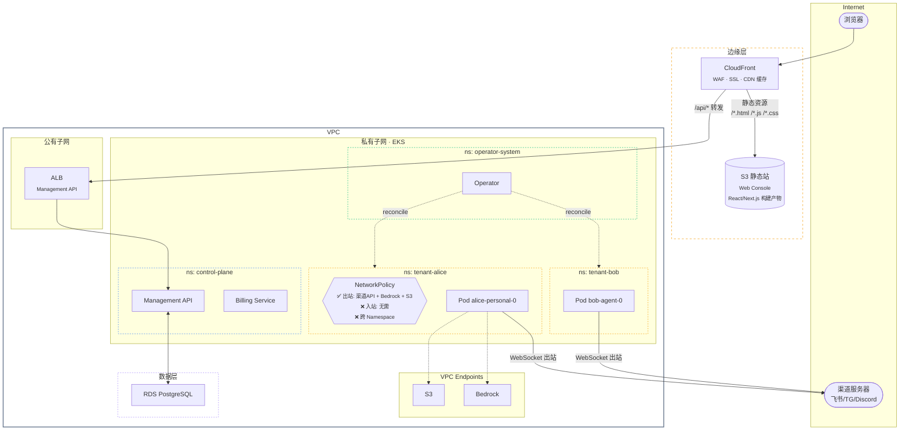

# OpenClaw on EKS — SaaS 架构设计 V3（精简版：Operator + WebSocket，无 Router）

## 设计原则

1. **Operator 是核心** —— 单实例生命周期完全交给 k8s-operator
2. **WebSocket 模式** —— 每个 Pod 自己连渠道，无需 Router
3. **薄控制面** —— 只需 Management API + Web Console + Billing
4. **Namespace 级隔离** —— 每租户独立 Namespace，支持多 Agent
5. **自建 JWT 认证** —— 简单可控

---

## 总体架构



---

## 与 V2 的区别

| 维度 | V2（有 Router） | V3（无 Router） |
|------|----------------|----------------|
| 消息接收 | Router 统一 Webhook 入口 | **每个 Pod 自己 WebSocket 连渠道** |
| Router 服务 | 需要开发和部署 | **不需要** |
| Redis | 路由缓存 | **不需要** |
| 公网入口 | Router 需要公网 | **Pod 主动出站，不需要公网入口** |
| 组件数 | Operator + Router + Mgmt API + Billing | **Operator + Mgmt API + Billing** |
| 外部依赖 | Redis + S3 + PostgreSQL | **S3 + PostgreSQL**（去掉 Redis） |
| 开发人数 | 3 人（Router / Platform / Infra） | **2 人（Platform / Infra）** |
| 适合规模 | 50-500+ 租户 | **< 50 租户（MVP）** |

---

## 消息流转（WebSocket 模式）



**关键：没有 Router 参与，Pod 直接跟渠道通信。**

---

## 租户创建流程



---

## 渠道凭证管理

租户在 Web Console 配置渠道时，Management API 把凭证写入 CRD：

```yaml
apiVersion: openclaw.rocks/v1alpha1
kind: OpenClawInstance
metadata:
  name: alice-personal
  namespace: tenant-alice
spec:
  envFrom:
    - secretRef:
        name: alice-personal-keys    # 包含 Bot Token / App ID 等
  config:
    mode: merge
    raw:
      channels:
        telegram:
          enabled: true
          # Bot Token 从 Secret 环境变量注入
        feishu:
          enabled: true
          accounts:
            default:
              # App ID/Secret 从 Secret 环境变量注入
          groups:
            "*":
              requireMention: true
  storage:
    persistence:
      enabled: true
      size: 10Gi
    backup:
      enabled: true
      s3:
        bucket: openclaw-saas-backups
        prefix: "tenants/alice/personal/"
```

```yaml
# Secret（Management API 自动创建）
apiVersion: v1
kind: Secret
metadata:
  name: alice-personal-keys
  namespace: tenant-alice
type: Opaque
stringData:
  TELEGRAM_BOT_TOKEN: "123456:ABC-DEF..."
  FEISHU_APP_ID: "cli_a1b2c3..."
  FEISHU_APP_SECRET: "xxxxx..."
  ANTHROPIC_API_KEY: "sk-ant-..."
```

**Pod 启动后，OpenClaw 读取这些配置，自动用 WebSocket 连接对应渠道。**

---

## 用量采集架构（Metrics Exporter Sidecar）

### 为什么用 Sidecar？

OpenClaw 本身不暴露 Prometheus /metrics，也不推送用量事件。但每个 session 的 token 用量都记录在本地文件里：

```
~/.openclaw/agents/main/sessions/
├── sessions.json          # session 级汇总：inputTokens, outputTokens, totalTokens
└── <session-id>.jsonl     # 每次 LLM 调用的 model, provider, stopReason
```

**Sidecar 方案与 LLM Provider 无关**——不管租户用 Bedrock、OpenAI、Anthropic 还是自建模型，统一从本地文件采集。

### 架构



### Sidecar 职责

```python
# metrics-exporter 伪代码

# 1. 定期读取 sessions.json
sessions = parse_sessions_json("/openclaw-data/agents/main/sessions/sessions.json")

# 2. 解析 JSONL 获取细粒度数据
for session in sessions:
    jsonl = parse_jsonl(f"/openclaw-data/agents/main/sessions/{session['id']}.jsonl")
    for entry in jsonl:
        if entry.get('model'):
            # 提取：model, provider, inputTokens, outputTokens, timestamp
            record_usage(entry)

# 3. 暴露 Prometheus metrics
#    openclaw_tokens_input_total{tenant="alice", agent="personal", model="claude-opus-4"}
#    openclaw_tokens_output_total{tenant="alice", agent="personal", model="claude-opus-4"}
#    openclaw_sessions_active{tenant="alice", agent="personal"}
#    openclaw_llm_requests_total{tenant="alice", agent="personal", model="claude-opus-4"}

# 4. 推送用量事件到 SQS（供 Billing 消费）
sqs.send_message(queue_url, {
    "tenant": "alice",
    "agent": "personal",
    "model": "claude-opus-4",
    "input_tokens": 1234,
    "output_tokens": 567,
    "timestamp": "2026-03-06T06:00:00Z"
})
```

### Prometheus Metrics

| 指标 | 类型 | Labels | 说明 |
|------|------|--------|------|
| `openclaw_tokens_input_total` | Counter | tenant, agent, model | 输入 token 累计 |
| `openclaw_tokens_output_total` | Counter | tenant, agent, model | 输出 token 累计 |
| `openclaw_llm_requests_total` | Counter | tenant, agent, model, provider | LLM 调用次数 |
| `openclaw_sessions_active` | Gauge | tenant, agent | 活跃 session 数 |
| `openclaw_session_duration_seconds` | Histogram | tenant, agent | Session 持续时间 |

### CRD 配置

Operator 创建 Pod 时需要注入 sidecar。通过 CRD 的 `sidecars` 或 Management API 在 Pod spec 里追加：

```yaml
apiVersion: openclaw.rocks/v1alpha1
kind: OpenClawInstance
metadata:
  name: alice-personal
  namespace: tenant-alice
spec:
  # ... 其他配置 ...
  podTemplate:
    additionalContainers:
      - name: metrics-exporter
        image: openclaw-saas/metrics-exporter:latest
        ports:
          - containerPort: 9090
            name: metrics
        env:
          - name: TENANT_NAME
            value: "alice"
          - name: AGENT_NAME
            value: "personal"
          - name: SQS_QUEUE_URL
            valueFrom:
              configMapKeyRef:
                name: saas-config
                key: sqs-usage-queue-url
        volumeMounts:
          - name: openclaw-data
            mountPath: /openclaw-data
            readOnly: true
        resources:
          requests:
            cpu: 50m
            memory: 64Mi
          limits:
            cpu: 100m
            memory: 128Mi
    podAnnotations:
      prometheus.io/scrape: "true"
      prometheus.io/port: "9090"
      prometheus.io/path: "/metrics"
```

### 数据流：用量 → 计费

```
Agent Pod                    SQS                  Billing Service        PostgreSQL
   │                          │                        │                     │
   │ Sidecar 解析 JSONL      │                        │                     │
   │ 每 60s 推送用量事件 ──→ │                        │                     │
   │                          │ ──→ 消费用量事件 ──→  │                     │
   │                          │                        │ 聚合 → 写入 ─────→ │
   │                          │                        │                     │
   │ Prometheus scrape        │                        │                     │
   │ ←── :9090/metrics        │                        │                     │
   │                          │                        │                     │
                         Grafana 展示用量 Dashboard
```

---

## 租户 Namespace 结构

```
EKS Cluster
├── namespace: openclaw-operator-system
│   └── Operator Deployment
│
├── namespace: control-plane
│   ├── Management API ×2
│   ├── Billing Worker
│   └── (连接 RDS PostgreSQL)
│
├── namespace: tenant-alice
│   ├── OpenClawInstance: alice-personal  → Pod (Agent + Metrics Sidecar) → WebSocket → 飞书 + Telegram
│   ├── OpenClawInstance: alice-work      → Pod (Agent + Metrics Sidecar) → WebSocket → Discord
│   ├── Secret: alice-personal-keys
│   ├── Secret: alice-work-keys
│   ├── ResourceQuota
│   ├── LimitRange
│   └── NetworkPolicy
│
├── namespace: tenant-bob
│   ├── OpenClawInstance: bob-agent       → Pod (WebSocket → 飞书)
│   ├── Secret: bob-agent-keys
│   ├── ResourceQuota
│   └── NetworkPolicy
│
└── namespace: monitoring
    ├── Prometheus
    ├── Grafana
    └── Loki
```

---

## 网络架构



### Web Console 部署方式

```
构建流程：
  React/Next.js 源码 → npm run build → 静态文件（HTML/JS/CSS）

部署：
  GitHub Actions → 构建 → 上传到 S3 桶 → CloudFront 自动失效缓存

访问路径（同一域名，CloudFront 按路径分发）：
  浏览器 → https://console.openclaw-saas.com
    ├── /api/*  → CloudFront → ALB → Management API (EKS)
    └── /*      → CloudFront → S3 桶（静态资源）
```

**优势：**
- Web Console 不占 EKS 资源
- CloudFront 全球 CDN 加速
- S3 托管几乎零成本
- 前后端同域，无 CORS 问题

---

## 数据架构

| 存储 | 用途 | 数据 |
|------|------|------|
| **K8s CRD** | Agent 实例注册表 | 实例配置、状态 |
| **K8s Namespace** | 租户隔离 | ResourceQuota, NetworkPolicy |
| **K8s Secret** | 渠道凭证 | Bot Token, App ID/Secret, API Key |
| **RDS PostgreSQL** | 用户 + 计费 | 注册信息、订阅、用量、账单 |
| **EBS PVC** | Agent 运行时 | 会话、记忆、工作区 |
| **S3 (备份桶)** | Agent 备份 | 状态定时备份 |
| **S3 (静态站桶)** | Web Console | React/Next.js 构建产物，CloudFront 分发 |
| **SQS** | 用量事件 | Sidecar → SQS → Billing 消费 |
| **Prometheus** | 实时指标 | Sidecar 暴露 /metrics，Prometheus scrape |

**去掉了 Redis（不需要路由缓存）。**

---

## 关键设计决策

| 决策 | 选择 | 原因 |
|------|------|------|
| 消息接收 | **WebSocket**（非 Webhook） | 无需 Router、无需公网入口、架构简单 |
| Router | **不需要** | Pod 直连渠道，天然隔离 |
| Redis | **不需要** | 没有路由缓存需求 |
| Web Console | **S3 + CloudFront** | 不占 EKS 资源、CDN 加速、零成本托管 |
| 用量采集 | **Metrics Exporter Sidecar** | Provider 无关，解析本地 JSONL，暴露 Prometheus + 推送 SQS |
| 租户隔离 | **Namespace 级** | RBAC + NetworkPolicy + ResourceQuota |
| 多 Agent | **每租户多个 CRD** | 灵活配置 |
| 认证 | **自建 JWT** | 简单可控 |
| Pod 生命周期 | **Operator reconcile** | 成熟方案 |

---

## MVP 范围 (Phase 1)

### 包含 ✅
- [ ] Management API（Namespace + CRD CRUD + JWT 认证 + 渠道凭证管理）
- [ ] Web Console（登录 + Dashboard + Agent 管理 + 渠道配置）
- [ ] Billing Service（SQS 用量消费 + Stripe）
- [ ] k8s-operator 部署（Helm）
- [ ] EKS 集群 + IaC
- [ ] 每租户独立 Namespace
- [ ] Prometheus + Grafana 监控
- [ ] Karpenter 节点伸缩
- [ ] CI/CD Pipeline

### 不包含 ❌ (Phase 2+)
- Router（Webhook 模式，规模化后再加）
- Kata VM 隔离
- 多区域部署
- OAuth2 / SSO
- 自定义域名

### Phase 2 升级路径
当租户超过 50 个或遇到 WebSocket 连接数瓶颈时：
1. 开发 Router 服务
2. 加 Redis 路由缓存
3. 租户 Pod 配置从 WebSocket 切换到 Webhook 模式
4. 在渠道平台设置 Webhook URL 指向 Router
